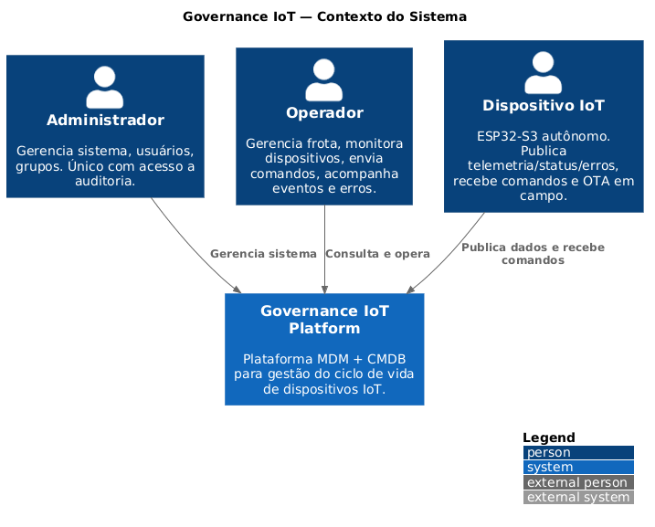
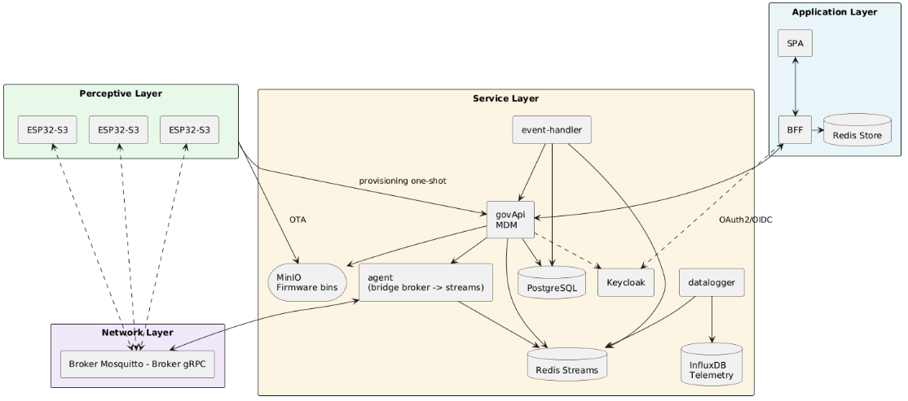

# Governance IoT

  

### Projeto de Iniciação Tecnológica e Inovação — Universidade Presbiteriana Mackenzie (FCI-UPM) · Laboratório MackLeaps

  

Plataforma de governança e gerenciamento do ciclo de vida de dispositivos IoT, integrando conceitos de **MDM** (*Mobile Device Management*) e **CMDB** (*Configuration Management Database*) em uma arquitetura orientada a eventos.

  

> [!NOTE]
> Este projeto oferece implementações distintas que exploram diferentes paradigmas de arquiteturas de governança modernas. Cada abordagem é mantida em variante independente do código, permitindo comparação empírica entre latência de revoke, complexidade de firmware, footprint operacional e consumo de rede.

  

#### Arquiteturas de identidade

  

A gestão de identidade e os modelos de autenticação são pilares críticos na segurança de ambientes IoT. Para avaliar diferentes níveis de escalabilidade e delegação de confiança, a plataforma contempla 3 alternativas:

  
| Modelo | Autoridade | Autenticação | Revoke |
|---|---|---|---|
| **A — Centralizada mTLS** | MDM + Root CA própria | Certificado X.509 único assinado pela Root CA | CRL propagada ao broker |
| **B — Centralizada OAuth2** | MDM + Keycloak (IAM) | JWT access token assinado pelo Keycloak | Invalidação de token/client no IAM |
| **C — Descentralizada DID** | Blockchain | Par de chaves gerado no device com DID auto-emitido | Transação de revoke on-chain |


  

#### Protocolos de Comunicação

  

A camada de rede foi desenhada para suportar arquitetura baseada em Broker, utilizando Protocol Buffers (Protobuf) em ambas as abordagens para garantir máxima eficiência.

  

- **MQTT**: implementação focada no padrão de mercado para IoT, utilizando o broker Eclipse Mosquitto — amplamente testado e recomendado.

- **gRPC**: proposta em ascensão no cenário de IoT, focada em segurança e comunicação fortemente tipada, com broker open-source escrito em Rust para altíssima performance.

  

#### Implementações disponíveis

  

Onde encontrar cada uma no repositório:

  

| Abordagem | Protocolo | Broker | Path |
|---|---|---| --- |
| **A - Centralizada (mTLS)** | MQTT | Mosquitto | branch `main` | 
| **B - Centralizada (OAuth2)** | MQTT | Mosquitto |branch `alt/oauth2-jwt` | 
| **C - Descentralizada (DID)** | gRPC | Broker Rust | planejada | 

  

---

  

## Contexto

  

Com a expansão das *Smart Cities* e a previsão de mais de 29 bilhões de dispositivos conectados até 2030, a implantação em massa de microcontroladores de baixo custo expõe lacunas críticas de governança, segurança e escalabilidade. Frameworks tradicionais de TI não foram projetados para lidar com a heterogeneidade, a descentralização e as restrições de recursos desses dispositivos.

  

Este projeto responde diretamente à escassez de implementações práticas apontada por Sedrati et al. (2023) no framework IoT-Gov, concentrando esforços no terceiro pilar: **Gerenciamento de Dispositivos** — desde o provisionamento inicial até a revogação na rede.

  

---

  

## O que a plataforma faz

  

Cinco capacidades cobertas por todas as implementações

  

- **Provisiona** microcontroladores de forma prática e automática.

- **Monitora** o estado da frota em tempo real via telemetria e eventos de interesse

- **Comanda** dispositivos remotamente: atualizações de firmware (OTA), firmware rollback, reboot, deep sleep

- **Revoga** acesso de dispositivos comprometidos

- **Registra** o inventário e o histórico de configurações no CMDB

  

---

  

## Arquitetura

  

O sistema segue o modelo de referência de Arquitetura IoT em Camadas (Umar et al., 2018; Gheorghe, 2025), estruturado em quatro *layers*:




---

  

## Estrutura do repositório

  

```

governance-iot/

├── perceptive-layer/    - Firmware ESP32-S3 (PROVISIONING + OPERATIONAL)

├── brokers/

│ ├── mosquitto/         - Broker MQTT (config + data + log)

│ └── broker-grpc/       - Broker gRPC (Rust)

├── platform-bins/       - Bootloader + partition-table do ESP32 (base pro provisioning package)

├── service-layer/

│ ├── governanceApi/     - API principal (MDM + CMDB)

│ ├── agents/agent-mqtt/ - Agent MQTT

│ ├── event-handler/     - Classificador de Eventos de Interesse

│ ├── datalogger/        - Persistência de telemetria (InfluxDB)

│ └── infra-executor/    - Executor de comandos de infra (exclusivo da impl A)

├── application-layer/

│ ├── bff/               - Backend for Frontend (sessão + OAuth2)

│ └── spa/               - Dashboard administrativo

├── deploy/keycloak/     - Template do realm IOT-REALM + entrypoint de import

├── keys/                - PKI local (gitignored — gerado por `make init-certs`)

├── docs/                - Documentação técnica

├── scripts/             - Scripts operacionais (init_certs, init_minio, upload_platform_bins, loadtest, …)

├── Makefile             - Targets de bootstrap e deploy (setup, up, down, status, …)

└── docker-compose.yml   - Stack de infra (Postgres, Keycloak, Redis, MinIO, InfluxDB, Broker)

```

  

---

  

## Perceptive Layer

  

Camada conhecida por englobar a infraestrutura física da arquitetura IoT, como sensores e os dispositivos.

Neste projeto, foi utilizado o ESP32-S3 como microcontrolador com a responsabilidade de coletar os dados dos sensores, monitorar sua própria integridade via firmware e empacotar essas informações para envio à camada superior.

O repositório contém duas variantes de firmware para a *Perception Layer*, explorando diferentes fases do ciclo de vida do device.

  

| Firmware | Fase | Responsabilidade |
|---|---|---|
| `FIRM_PROVISIONING` | Provisionamento | Primeira comunicação com o sistema para introdução segura na frota |
| `FIRM_OPERATIONAL` | Operação | Telemetria, comandos remotos

  

---

  

## Network Layer

  

Responsável pela transmissão de informações entre o hardware físico e o serviço, atuando como um canal de transporte de dados. A comunicação é intermediada por um Broker, estruturado para fornecer confidencialidade e controle de acesso, garantindo que apenas dispositivos registrados e autorizados pela nossa API consigam publicar ou consumir informações.

  

O repositório mantém duas implementações paralelas de broker:

  

- **Eclipse Mosquitto 2.0** — padrão de mercado em IoT, ampla adoção comunitária

- **Broker gRPC (Rust)** — proposta em ascensão no cenário IoT, comunicação fortemente tipada e altíssima performance

  

---

  

## Service Layer

  

Esta camada é o cérebro da arquitetura, responsável por monitorar e gerenciar todo o ciclo de vida dos dispositivos de forma autônoma, desde o registro até sua remoção do sistema. A telemetria é capturada por agentes independentes inscritos nos tópicos do Broker, que repassam as mensagens para um serviço dedicado a persistir os dados no banco de séries temporais (InfluxDB). Paralelamente, um outro serviço classificador de Eventos de Interesse (EoI) monitora os eventos e aciona a API principal (govApi) apenas quando necessário. Esta API principal foca exclusivamente na orquestração do MDM, executando regras de negócio, enviando comandos diretos ao microcontrolador e persistindo o estado da frota no banco relacional (CMDB).

  

---

  

## Application Layer

  

A camada de abstração voltada para os operadores de TI e administradores do sistema. Contempla os dashboards de observabilidade e a interface administrativa responsável por interagir com a API Principal, permitindo o acionamento de rotinas do MDM (como revogar acesso ou disparar atualizações em lote).

  

---

  

## Deploy

### Pré-requisitos

- **Docker**
- **≥ 8 GB RAM** livre (infra + serviços + broker)

### Passos comuns (todas as implementações)

Válidos independente da branch — precisam ser feitos uma vez antes do setup específico.

```bash
# 1. Clone
git clone https://github.com/ericdenser/governance-iot-platform.git
cd governance-iot-platform

# 2. .env
cp .env.example .env
# edite HOST_IP=<ip da maquina>   (obrigatório)
# demais secrets serão gerados automaticamente pelo init-secrets
# modifique keys, passwords e nomes como lhe convier 

# 3. Binários base do ESP32 (bootloader + partition-table)
#    O bootloader e o partition já vem prontos junto com 
#    a versão de provisioning em platform-bins/, modifique se achar necessário:
#       platform-bins/bootloader.bin
#       platform-bins/partition-table.bin
#       platform-bins/provisioning_firmware.bin
#    O upload pro MinIO acontece automaticamente no `make setup` (via upload-bin).
```

Ao final de qualquer setup, assumindo as portas padrões: **`http://<HOST_IP>:5173`** — dashboard SPA (login `admin` / `admin`).

---

### Implementação A — mTLS (branch `main`)

Broker Mosquitto com autenticação por certificado X.509 (Root CA local + cert por device). Revoke via CRL propagada ao broker.

```bash
git checkout main
make setup
```

`make setup` na branch `main` executa em ordem:

| Passo | Target | O que faz |
|---|---|---|
| 1 | `check-env` | Valida `.env` e `HOST_IP` |
| 2 | `init-secrets` | Gera secrets aleatórios: passwords Keycloak/Postgres, client_secrets, **`CA_PASSWORD`**, **`AGENT_KEYSTORE_PASS`**, **`AGENT_TRUSTSTORE_PASS`**, `INFRA_API_KEY` |
| 3 | `init-certs` | Gera Root CA (ECC) + cert do broker (CN=HOST_IP) + cert do agent + p12s, distribui pros bind mounts do broker/agent |
| 4 | `up-build` | Build das imagens + `up` sequencial com healthcheck |
| 5 | `upload-bin` | Publica `platform-bins/*.bin` no MinIO |

Se preferir controle passo-a-passo, os targets podem ser invocados individualmente na mesma ordem.

**Permissões dos certs/ACL pro Mosquitto (obrigatório):**

O container `iot-broker` roda como user `mosquitto` (UID 1883) e precisa ler os certs + `regras_acesso.acl`. O `init-certs` tenta fazer o `chown` via helper container, mas pode falhar em ambientes sem acesso ao Docker daemon. Se você vir `ERRO chown via docker falhou`, rode manualmente:

```bash
sudo chown -R 1883:1883 brokers/mosquitto/config/certs brokers/mosquitto/config/regras_acesso.acl
sudo chmod 640 brokers/mosquitto/config/certs/*.key
sudo chmod 644 brokers/mosquitto/config/certs/*.crt brokers/mosquitto/config/certs/*.crl
sudo chmod 0700 brokers/mosquitto/config/regras_acesso.acl
```

Depois `docker restart iot-broker` — deve subir healthy.

**Troubleshooting específico:**

- `iot-broker unhealthy` com `OpenSSL Error :: Permission denied` → cert files sem read pro UID 1883. Rode o `sudo chown` acima.
- `iot-broker unhealthy` com `Unable to load certificate revocation file` → `revoked.crl` corrompido/vazio. Rode `make clean-certs && make init-certs`.
- `govApi crash com "MAC invalid"` → `CA_PASSWORD` no `.env` dessincronizado com `keys/rootCA.p12`. Rode `make clean-certs && make init-certs && make up-build`.
- Depois de rodar `make init-certs`, sempre rebuildar apps que carregam certs: `make up-build`.

**Compilando o firmware (mTLS):**

O firmware valida o cert do broker contra a mesma Root CA gerada por `init-certs`. O `init-certs` copia `keys/rootCA.crt` para dentro de cada firmware (`perceptive-layer/mqtt_protobuff/*/rootCA.crt` ou `.../main/rootCA.crt`), e os `CMakeLists.txt` fazem `EMBED_TXTFILES "rootCA.crt"` para embarcar o cert no `.bin` final via símbolo `_binary_rootCA_crt_start`. Se você trocar a Root CA (novo `make init-certs`), **recompile e re-flash** os firmwares — o cert antigo embarcado não valida contra o broker novo.

Erro `undefined reference to _binary_rootCA_crt_start` no link do firmware → `rootCA.crt` não foi copiado pra pasta do firmware. Rode `make init-certs` novamente (na raiz do repo) antes de `idf.py build`.

---

### Implementação B — OAuth2/JWT (branch `alt/oauth2-jwt`)

Broker Mosquitto com plugin `mosquitto-go-auth` que valida JWT emitido pelo Keycloak. Revoke via invalidação de token/client no Keycloak.

```bash
git checkout alt/oauth2-jwt
make setup
```

`make setup` na branch `alt/oauth2-jwt` executa:

| Passo | Target | O que faz |
|---|---|---|
| 1 | `check-env` | Valida `.env` e `HOST_IP` |
| 2 | `init-secrets` | Gera secrets do Keycloak (`GOVAPI_CLIENT_SECRET`, `AGENT_MQTT_CLIENT_SECRET`, `BFF_CLIENT_SECRET`, `IOT_ADMIN_PASSWORD`) e passwords infra |
| 3 | `up-build` | Build das imagens + `up` sequencial com healthcheck. Broker sobe com plugin gov-auth que consulta govApi em `/auth/mqtt-verify` e `/auth/mqtt-acl` |
| 4 | `upload-bin` | Publica `platform-bins/*.bin` no MinIO |


**Troubleshooting específico:**

- Latência PUBACK sobe em burst inicial (~2min após ramp) → cache do plugin expirando (default `auth_opt_auth_cache_seconds 120`). Aumentar em `brokers/mosquitto/config/mosquitto.conf`.
- `iot-broker` reinicia loop com log `AUTH_FAILED` → confira se `KEYCLOAK_ISSUER_URI` no `.env` bate com `KC_HOSTNAME` do Keycloak.
- Token do device expira em runtime → aumentar `DEVICE_TOKEN_LIFESPAN_S` no `.env` (default 300s). Trade-off: revoke mais lento.

---

### Implementação C — DID (planejada)

Autenticação descentralizada com DID emitido pelo próprio device, ancorada em blockchain. Broker gRPC em Rust (`brokers/broker-grpc/`). Ver.

_Setup a ser documentado quando a variante estiver estável._

---

### Comandos do Makefile

Alguns targets são específicos de uma implementação — coluna **Impl** indica.

| Target | Impl | O que faz |
|---|---|---|
| `make help` | todas | Lista todos os targets |
| `make init-secrets` | todas | Gera secrets aleatórios no `.env` (idempotente — não sobrescreve valores já preenchidos) |
| `make init-certs` | **A** | Gera Root CA + certs mTLS e distribui |
| `make init-minio` | todas | Cria bucket + access key no MinIO |
| `make upload-bin` | todas | Publica `platform-bins/*.bin` no MinIO em `gov/firmware/platform/` |
| `make setup` | todas | Wrapper: encadeia bootstrap + `up-build` (varia por branch) |
| `make up` | todas | Sobe stack sem rebuild (imagens em cache) |
| `make up-build` | todas | Rebuild imagens + sobe |
| `make down` | todas | Para todos containers, mantém volumes |
| `make restart` | todas | Restart sem rebuild |
| `make status` | todas | Health + restart count de todos containers |
| `make logs SVC=iot-govapi` | todas | Tail -f de um container específico |
| `make clean` | todas | Para tudo E apaga volumes (postgres, minio, influx, redis) — **destrutivo**, pede confirmação |
| `make clean-certs` | **A** | Apaga PKI local (força regeneração no próximo `init-certs`) |

---

### Troubleshooting comum

- **Portas em conflito**: `SPA_HOST_PORT`, `GOVAPI_HOST_PORT`, etc no `.env`.
- **Container fica restarting**: `make status` mostra restart count. `docker logs <container>` pra causa raiz.
- **`make up` demora ou trava**: healthcheck sequencial aguarda cada serviço ficar healthy. Timeout de 120s por serviço — se estourar, cheque logs.
- **Deploy em VM (rede, portas expostas, etc)**: [`docs/VM_SETUP.md`](docs/VM_SETUP.md).

  

---

  

## Documentação Técnica

  

Aprofundamentos técnicos organizados por tema em [`docs/`](docs/):

  

**Arquitetura e design**

- [Arquitetura geral](docs/ARCHITECTURE.md)

- [Modelo de domínio](docs/DOMAIN_MODEL.md)

- [Modelo de autorização](docs/AUTHORIZATION_MODEL.md)

- [Análise de segurança e escalabilidade](docs/SECURITY_SCALABILITY_ANALYSIS.md)

  

**Ciclo de vida do dispositivo**

- [Sequência de provisionamento](docs/PROVISIONING_SEQUENCE.md)

- [Ciclo de vida do firmware](docs/FIRMWARE_LIFECYCLE.md)

- [Tuning de rollout OTA](docs/OTA_ROLLOUT_TUNING.md)

- [Cenários de rollback OTA](docs/OTA_ROLLBACK_SCENARIOS.md)

  

**Implementações específicas**

- [Alt A - mTLS ](docs/mtls-docs/README.md)

- [Alt B - OAuth2/JWT ](docs/oauth-docs/README.md)

- [Alt C - DID](docs/did-docs.md)

  

**Operacional**

- [Setup em VM](docs/VM_SETUP.md)

- [Contrato Redis Streams](docs/REDIS_STREAMS_CONTRACT.md)

  

---

  

## Licença

  

Projeto acadêmico desenvolvido no âmbito da Iniciação Tecnológica FCI-UPM.

Atribuições de terceiros em [`LICENSES/`](LICENSES/).
  

---

  

## Instituição

  

Projeto desenvolvido no laboratório **MackLeaps** da Faculdade de Computação e Informática da Universidade Presbiteriana Mackenzie (FCI-UPM)
